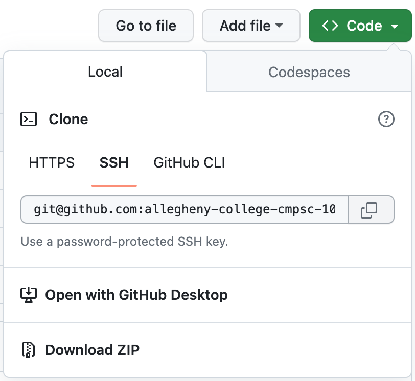

[](https://classroom.github.com/a/HGuVCkC_)
# Data Visualization Lab

In this lab, you will use dictionaries and lists in VPython to visualize a dataset. The techniques from November 8's exercise will be important to this lab. If you complete the main objectives for this lab, you will get credit for **variables**, **dictionaries**, **lists**, **for-loops**, and likely **if-else**. You can get creative and also deploy **while-loops**, **math-logic**, **functions**, **return**, and/or **classes and methods**. 

This lab is meant to help you to progress toward most [learning outcomes](https://github.com/allegheny-college-cmpsc-100-fall-2023/course-materials#learning-outcomes) listed in the syllabus, including Python programming, industry standard tools (like git and VSCode, and designing original projects. 

> [!NOTE]
> - There is no Gatorgrader in this lab yet, as I want to focus on reading the instructions. However, I will add a gatorgrader later, and I expect you to **push at least three commits** in the course of completing this lab. 
> - One major caveat of this lab: 3D is rarely the clearest way to do a data visualization, because it makes it hard to have a consistent sense of scale. However, I want to get some data expereince without having to learn completely new tools. One option to manage with this is to use [2D shapes in Vpython](https://www.glowscript.org/docs/VPythonDocs/shapes.html) and get an independent research credit.

## Instructions 

### Step One: Clone this repo

1. Open you `CMPSC-100` folder in VSCode.
2. Copy the clone link for this repo by clicking the \<Code\> dropdown just above the list of files, then choose SSH and hit the double-square copy icon. Open the Terminal in VSCode with Terminal>New Terminal then enter `git clone <text you just copied>`. When repo finishes cloning, `cd` into the new directory. 

    


### Step Two: Choose a dataset and make a plan

1. There are a LOT of datasets on the internet. You can choose any dataset you want, but it'll be helpful if it's in `.csv` format, and the data are stored in a way that's easy to understand (you only have a week for this particular lab.) [FiveThirtyEight](https://github.com/fivethirtyeight/data) has a lot of data that's stored in a legible format, so it might be a good idea to start looking there.
2. Before selecting your dataset, look at it carefully and make sure you understand how the data work and how you will access them. The tally technique shown in the demo will only work for certain kinds of data. Is the data stored in binary like with the demo? Are there simple totals, percentages, or averages you can use in each column? Some datasets may not need as much processing — for example, [this dataset](https://github.com/fivethirtyeight/data/blob/master/bad-drivers/bad-drivers.csv) has percentages you could use straightaway. Others may need much more processing, and in that case you should probably find another dataset.
3. Look at several datasets and choose one that you really find interesting. Don't just pick the first one you click.
4. Think about an *argument* you can make by visualizing the data, and think about how to visualize a data in such a way as to support your argument. It can be short, sweet, simple, but think about your data as in service of something bigger. 
5. In the file called PLAN.md, write a paragraph or two (150+ words) about the argument you plan to make with your data, and how you plan to make it. You should continue the format the data is stored in, and how you plan to visualize it in Vpython. You can do a bar chart like the one in the demo, but you should go above and beyond the demo in your execution (think about animation, supporting text, supporting images, etc.). You can also do something else than a bar chart. See some examples of creative but clear data visualizations [here](https://github.com/allegheny-college-cmpsc-100-fall-2023/Data-Visualization-Lab/blob/main/README.md#data-visualiation-examples). 

### Step Three: Execute Your Plan

1. Write your code in `main.py`
2. The first thing you'll want to do is put your `.csv` file into the local repo, and import it using something like the for loop in the demo:

```
with open('<filename>.csv', newline='') as csvfile: #imports csv
    reader = csv.DictReader(csvfile) #converts each row of csv into a dictionary, creating a list of dictionaries with the same keys
    for row in reader: #iterates through each row in the csv file
        for key in row: #iterates through each key in the dictionary (i.e. each column in the csv)
```
2. Next, use the imported list of dictionaries to create your data visualization in VPython. To get credit for a coding concept, include a comment above the relevant code with the concept name in all-caps. So for for-loops, put a comment # FOR-LOOPS just above the code your using. If you use a concept more than once, flag the instance that you found the most challenging.

You also must document code thoroughly with comments to get credit.

3. Each time you add a major change to your code, commit and push those changes. You should commit at least three commits through the course of the lab:
   
```
git add .
git commit -m "<include a commit message>"
git push

```
### Step Four: Reflection

In order to get a "reflection" checkmark for this lab, write at least two hundred words inside "REFLECTION.md" in which you reflect on your technical and conceptual goals and accomplishments with this lab. You will also consider the strengths and weaknesses of Python itself. To receive credit, your response should address each of the following bullet points.

- Was this project effective in clearly communicating what the data say and your related argument, as you imagined in PLAN.md?
    - What techniques were most effective?
    - What would you do to further achieve these goals if you had more time?
- How has this project helped you to develop and apply your coding skills?
- When it comes to Python and VPython, do you feel the language and library are well-designed? Is there anything that could change to make the language more effective?

### Data Visualiation Examples

Note that often, when it comes to data visualization, less is more. These examples use creative design but still allow the data to do most of the talking. 

- ["Wealth Shown to Scale"](https://mkorostoff.github.io/1-pixel-wealth/), Mark Korosftoff
- ["How Popular is Joe Biden?"](https://projects.fivethirtyeight.com/polls/approval/joe-biden/?ex_cid=abcpromo), FiveThirtyEight
- ["Can You Gerrymander Your Way to Power?"](https://www.nytimes.com/interactive/2022/01/27/us/politics/congressional-gerrymandering-redistricting-game-2022.html), NYTimes
- [Untitled](https://www.instagram.com/p/BDMJ4G2B3nG/?taken-by=lianafinck), Liana Finck <-- less literal and yet...
